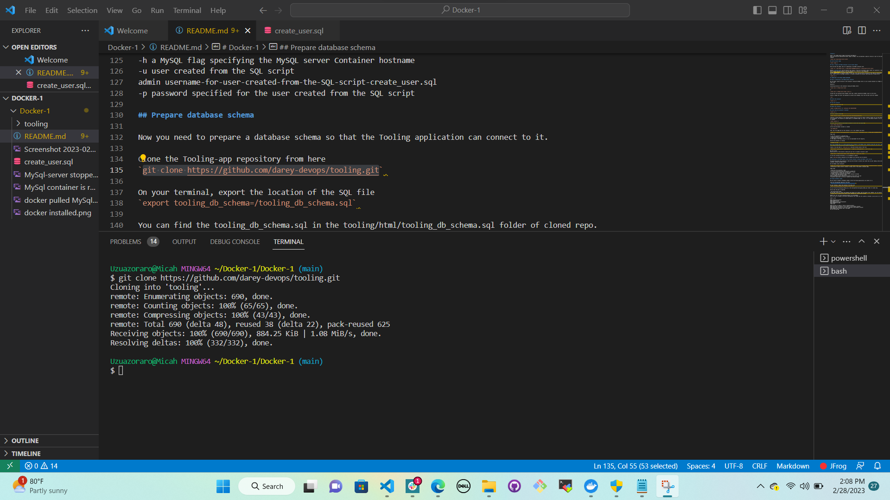
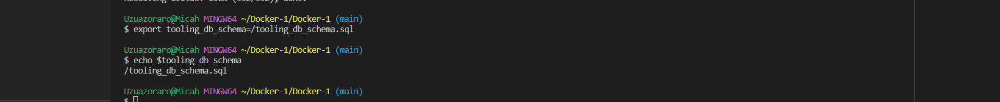
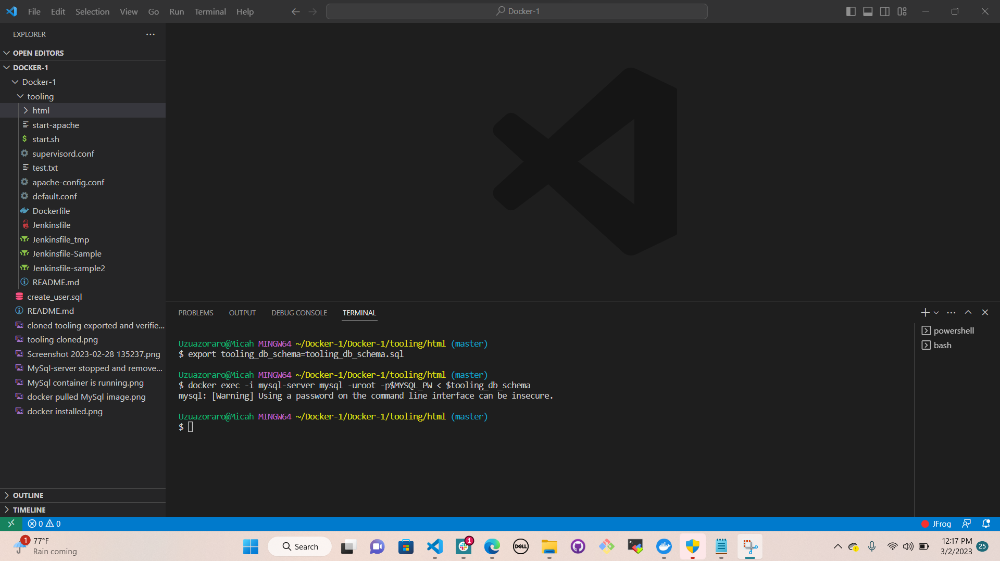
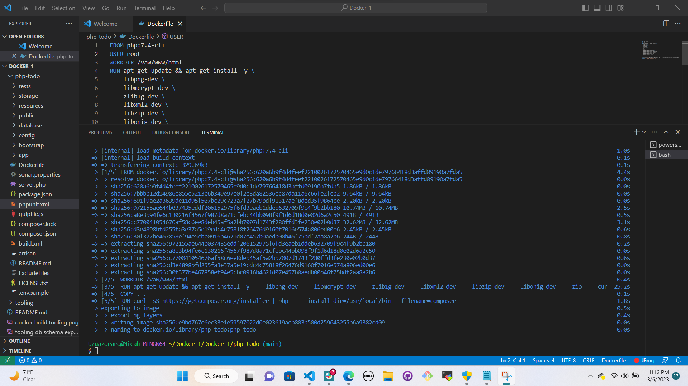
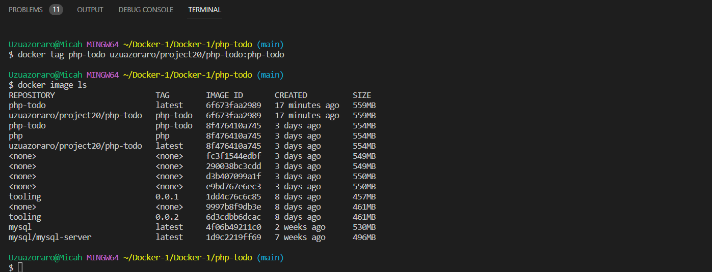
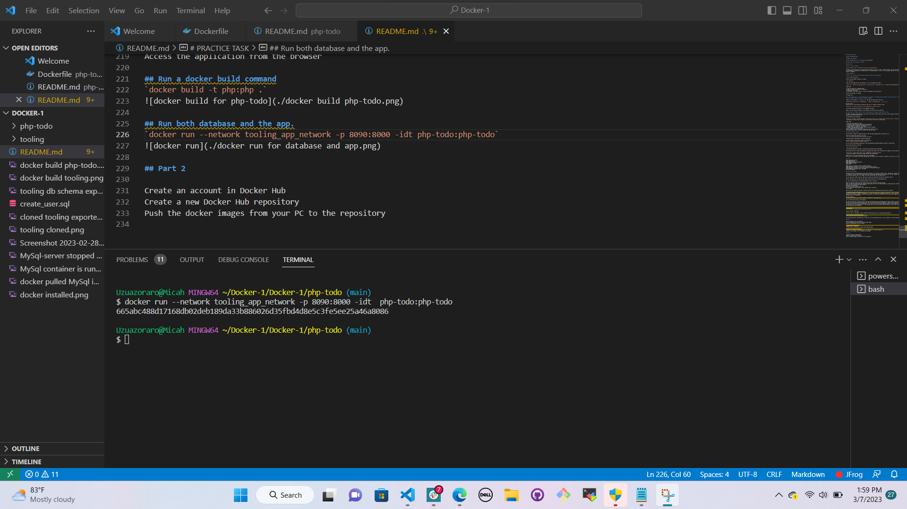
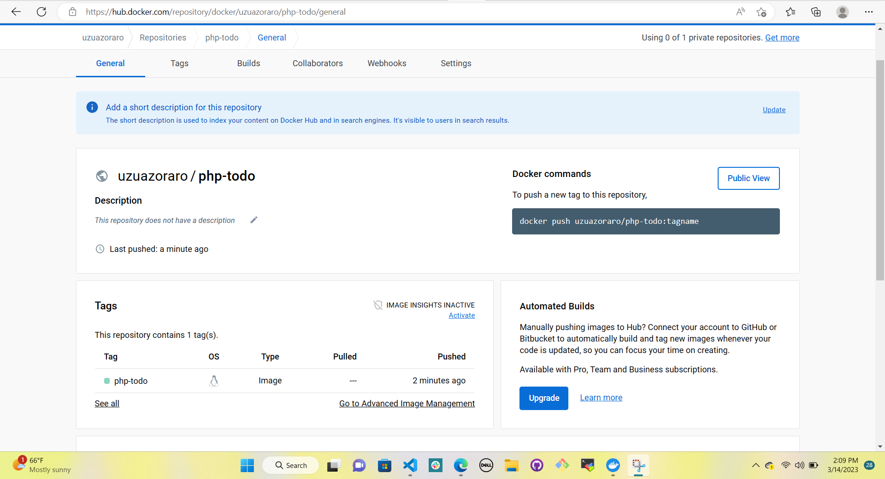
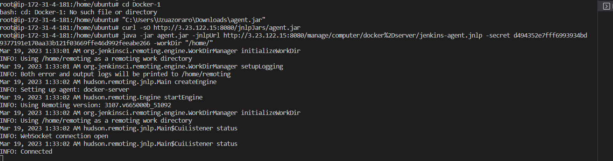
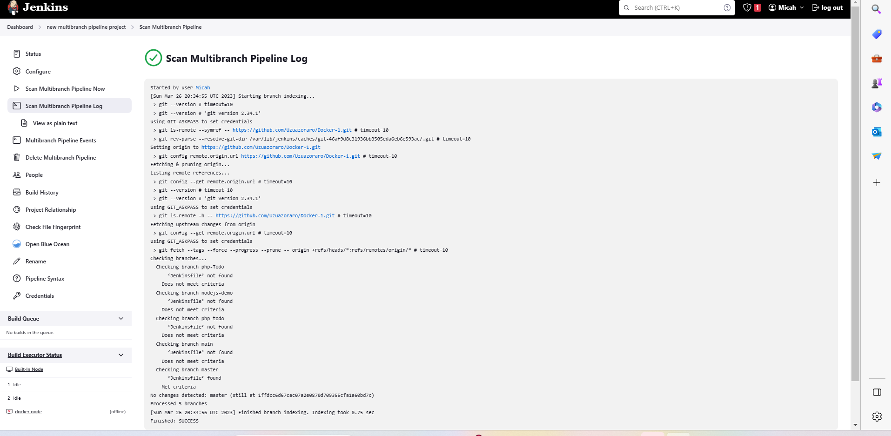

# MIGRATION TO THE СLOUD WITH CONTAINERIZATION. PART 1 – DOCKER & DOCKER COMPOSE

## Install docker

Step 1: Pull MySQL Docker Image from Docker Hub Registry
Start by pulling the appropriate Docker image for MySQL. You can download a specific version or opt for the latest release, as seen in the following command:

`docker pull mysql/mysql-server:latest`

## Confirm Docker image

`docker image ls`

## Step 2: Deploy the MySQL Container to your Docker Engine

Once you have the image, move on to deploying a new MySQL container with:

`docker run --name mysql-server -e MYSQL_ROOT_PASSWORD=passWord -d mysql/mysql-server:latest`

Replace <container_name> with the name of your choice. If you do not provide a name, Docker will generate a random one
The -d option instructs Docker to run the container as a service in the background
Replace <my-secret-pw> with your chosen password
In the command above, we used the latest version tag. This tag may differ according to the image you downloaded
Then, check to see if the MySQL container is running: Assuming the container name specified is mysql-server

`docker ps -a`

## CONNECTING TO THE MYSQL DOCKER CONTAINER

## Step 3: Connecting to the MySQL Docker Container

We can either connect directly to the container running the MySQL server or use a second container as a MySQL client. Let us see what the first option looks like.

Approach 1

Connecting directly to the container running the MySQL server:

`docker exec -it mysql-server bash`

or

`docker exec -it mysql-server mysql -uroot -p`

Provide the root password when prompted. With that, you’ve connected the MySQL client to the server.

Finally, change the server root password to protect your database. Exit the the shell with exit command

`exit`

## Verify the container

`docker ps -a`

## Stop the container

`docker stop mysql-server`

## Remove the container

`docker rm mysql-server` or `<container ID> 04a34f46fb98`

## verify that the container is deleted

`docker ps -a`

## First, create a network

`docker network create --subnet=172.18.0.0/24 tooling_app_network`

Creating a custom network is not necessary because even if we do not create a network, Docker will use the default network for all the containers you run. By default, the network we created above is of DRIVER Bridge. So, also, it is the default network. You can verify this by running the docker network ls command.

`docker network ls`

## First, let us create an environment variable to store the root password

`export MYSQL_PW=passWord`

verify the environment variable is created

`echo $MYSQL_PW`

Then, pull the image and run the container, all in one command like below:

`docker run --network tooling_app_network -h mysqlserverhost --name=mysql-server -e MYSQL_ROOT_PASSWORD=$MYSQL_PW  -d mysql/mysql-server:latest`

Flags used

-d runs the container in detached mode
--network connects a container to a network
-h specifies a hostname
If the image is not found locally, it will be downloaded from the registry.

Verify the container is running:

 $ docker ps -a

 ## Execute into mysql container with:
 docker exec -it mysql-server mysql -uroot -p

## As you already know, it is best practice not to connect to the MySQL server remotely using the root user. Therefore, we will create an SQL script that will create a user we can use to connect remotely

Create a file and name it `create_user.sql` and add the below code in the file:

`CREATE USER 'uzuazoraro'@'%' IDENTIFIED BY ''; GRANT ALL PRIVILEGES ON * . * TO ''@'%';`

Run the script:
Ensure you are in the directory create_user.sql file is located or declare a path

`docker exec -i mysql-server mysql -uroot -p$MYSQL_PW create_user.sql`

If you see a warning like below, it is acceptable to ignore:

mysql: [Warning] Using a password on the command line interface can be insecure.

## Connecting to the MySQL server from a second container running the MySQL client utility

The good thing about this approach is that you do not have to install any client tool on your laptop, and you do not need to connect directly to the container running the MySQL server.

Run the MySQL Client Container:

`docker run --network tooling_app_network --name mysql-client -it --rm mysql mysql -h mysqlserverhost -uuzuazoraro  -p`

Flags used:

--name gives the container a name
-it runs in interactive mode and Allocate a pseudo-TTY
--rm automatically removes the container when it exits
--network connects a container to a network
-h a MySQL flag specifying the MySQL server Container hostname
-u user created from the SQL script
admin username-for-user-created-from-the-SQL-script-create_user.sql
-p password specified for the user created from the SQL script

## Prepare database schema

Now you need to prepare a database schema so that the Tooling application can connect to it.

Clone the Tooling-app repository from here
`git clone https://github.com/darey-devops/tooling.git`

Change directory into tooling - `cd tooling`
change into html file - `cd html`

On your terminal, export the location of the SQL file
`export tooling_db_schema=tooling_db_schema.sql`

You can find the tooling_db_schema.sql in the tooling/html/tooling_db_schema.sql folder of cloned repo.

Verify that the path is exported

`echo $tooling_db_schema`

Use the SQL script to create the database and prepare the schema. With the docker exec command, you can execute a command in a running container.

`docker exec -i mysql-server mysql -uroot -p$MYSQL_PW < $tooling_db_schema`

Update the .env file with connection details to the database
The .env file is located in the html tooling/html/.env folder but not visible in terminal. you can use vi or nano

`vi .env`

MYSQL_IP=mysqlserverhost
MYSQL_USER=username
MYSQL_PASS=client-secrete-password
MYSQL_DBNAME=toolingdb
Flags used:

MYSQL_IP mysql ip address "leave as mysqlserverhost"
MYSQL_USER mysql username for user export as environment variable
MYSQL_PASS mysql password for the user exported as environment varaible
MYSQL_DBNAME mysql databse name "toolingdb"
Run the Tooling App

## Run the Tooling App

Containerization of an application starts with creation of a file with a special name - 'Dockerfile' (without any extensions). This can be considered as a 'recipe' or 'instruction' that tells Docker how to pack your application into a container. In this project, you will build your container from a pre-created Dockerfile, but as a DevOps, you must also be able to write Dockerfiles.

You can watch this video to get an idea how to create your Dockerfile and build a container from it.

And on this page, you can find official Docker best practices for writing Dockerfiles.

So, let us containerize our Tooling application; here is the plan:

Make sure you have checked out your Tooling repo to your machine with Docker engine
First, we need to build the Docker image the tooling app will use. The Tooling repo you cloned above has a Dockerfile for this purpose. Explore it and make sure you understand the code inside it.
Run docker build command
Launch the container with docker run
Try to access your application via port exposed from a container
Let us begin:

## Ensure you are inside the directory "tooling" that has the file Dockerfile and build your container:

`docker build -t tooling:0.0.1 .`

In the above command, we specify a parameter -t, so that the image can be tagged tooling"0.0.1 - Also, you have to notice the . at the end. This is important as that tells Docker to locate the Dockerfile in the current directory you are running the command. Otherwise, you would need to specify the absolute path to the Dockerfile.

## Run the container:
 $ `docker run --network tooling_app_network -p 8085:80 -it tooling:0.0.1` 

Let us observe those flags in the command.

We need to specify the --network flag so that both the Tooling app and the database can easily connect on the same virtual network we created earlier.
The -p flag is used to map the container port with the host port. Within the container, apache is the webserver running and, by default, it listens on port 80. You can confirm this with the CMD ["start-apache"] section of the Dockerfile. But we cannot directly use port 80 on our host machine because it is already in use. The workaround is to use another port that is not used by the host machine. In our case, port 8085 is free, so we can map that to port 80 running in the container.

## PRACTICE TASK
=====================================================

Create a branch, "php-todo"

Practice Task №1 – Implement a POC to migrate the PHP-Todo app into a containerized application.

## Download php-todo repository from:
"https://github.com/darey-devops/php-todo.git"

The project below will challenge you a little bit, but the experience there is very valuable for future projects.

## Part 1

Write a Dockerfile for the TODO app
Run both database and app on your laptop Docker Engine
Access the application from the browser

## Run a docker build command
`docker build -t php:php .`

## Run both database and the app.
`docker run --network tooling_app_network -p 8090:8000 -idt php-todo:php-todo`

## Part 2

Create an account in Docker Hub
Create a new Docker Hub repository
Push the docker images from your PC to the repository

# Note that the repo image name in the CLI should be the same with the name in dockerhub. 
# This will enable it to push from CLI to dockerhub.

## Part 3

1. Write a Jenkinsfile that will simulate a Docker Build and a Docker Push to the registry
`docker network create jenkins`

# Create a node for docker in Jenkins.

# Result fron created node

Agent docker-server

`curl -sO http://3.23.122.15:8080/jnlpJars/agent.jar`
`java -jar agent.jar -jnlpUrl http://3.23.122.15:8080/manage/computer/docker%2Dserver/jenkins-agent.jnlp -secret d494352e7fff6993934bd9377191e170aa33b121f03669ffe46d992feeabe266 -workDir "/home/"`

add source > chose git > enter the repo url > 

2. Connect your repo to Jenkins
# Connect with your docker username and docker access token in jenkins global credentials.

3. Create a multi-branch pipeline
Click New item > Type a project name > select multibranch pipeline > select Branch Sources > add source > chose git > enter the repo url > 

4. Simulate a CI pipeline from a feature and master branch using previously created Jenkinsfile
create a feature branch using: git checkout -b feature
cd ..
5. Ensure that the tagged images from your Jenkinsfile have a prefix that suggests which branch the image was pushed from. For example,        feature-0.0.1.
6. Verify that the images pushed from the CI can be found at the registry.

## Deployment with Docker Compose

All we have done until now required quite a lot of effort to create an image and launch an application inside it. We should not have to always run Docker commands on the terminal to get our applications up and running. There are solutions that make it easy to write declarative code in YAML, and get all the applications and dependencies up and running with minimal effort by launching a single command.

In this section, we will refactor the Tooling app POC so that we can leverage the power of Docker Compose.

## First, install Docker Compose on your workstation from here
## Create a file, name it `tooling.yaml`
Begin to write the Docker Compose definitions with YAML syntax. The YAML file is used for defining services, networks, and volumes:
version: "3.9"
services:
  tooling_frontend:
    build: .
    ports:
      - "5000:80"
    volumes:
      - tooling_frontend:/var/www/html
